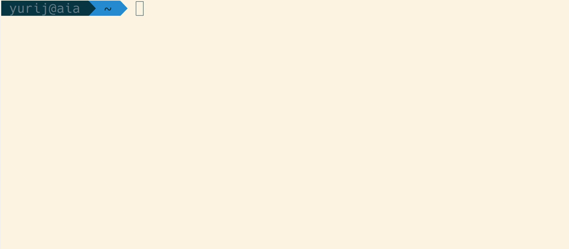

# rclip - AI-Powered Command-Line Photo Search Tool

[[Blog]](https://mikhalevi.ch/rclip-an-ai-powered-command-line-photo-search-tool/) [[Demo on YouTube]](https://www.youtube.com/watch?v=tAJHXOkHidw)

<div align="center">
  
</div>

**rclip** is a command-line photo search tool based on the awesome OpenAI's [CLIP](https://github.com/openai/CLIP) neural network.

## Installation

Currently, pre-built distributable is available only for Linux x86_64.

1. Download the AppImage from the latest [release](https://github.com/yurijmikhalevich/rclip/releases).

2. Execute following commands:

```bash
$ chmod +x <downloaded AppImage filename>
$ sudo mv <downloaded AppImage filename> /usr/local/bin/rclip
```

## Usage

```bash
$ cd photos && rclip "search query"
```



When you run **rclip** for the first time in a particular directory, it's going to extract features from the photos, and this takes time. How long it takes depends on your CPU and the number of photos you are going to search through. It took about a day to process 73 thousand of my photos on my NAS that runs an old-ish Intel Celeron J3455.

For the detailed demonstration, watch the video: https://www.youtube.com/watch?v=tAJHXOkHidw.

### How do I preview the results?

The command from below will open top-5 results for "kitty" in your default image viewer:

```bash
$ rclip -f -t 5 kitty | xargs -d '\n' -n 1 xdg-open
```

I prefer to use `feh`'s thumbnail mode to preview multiple results:

```bash
$ rclip -f -t 5 kitty | feh -f - -t
```

## Help

```bash
$ rclip --help
```

## Contributing

This repository follows the [Conventional Commits](https://www.conventionalcommits.org/en/v1.0.0/) standard.

## License

MIT
